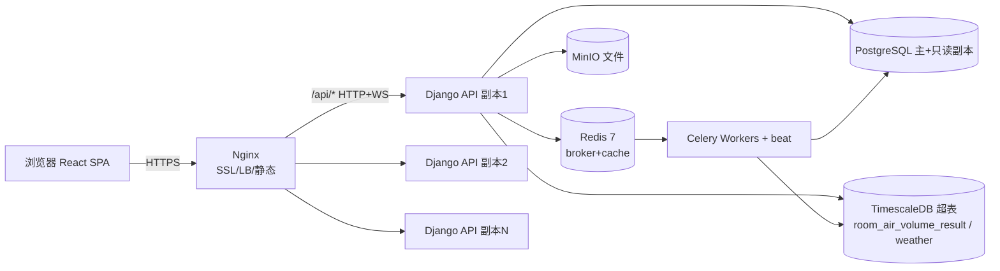

# 部署架构

> Version: 1.0
> Date: 2026-07-13
> Status: 已完成
> PRD 引用: F1-001, F6-001, F8-001, NF-027, NF-030, NF-032, NF-033, SAC-27
> 依赖文档: 系统架构设计 v1.0（§8 Deployment Architecture、§9 Monitoring & Observability、§7 Performance）、ADR-0002、PRD v0.5.1 第 17.5 章与第 18 章、系统设置模块（PRD 模块九 / §13）

---

## 概述

本文档在《系统架构设计 v1.0》§8 部署概览与 §9 监控基础上，细化到可执行部署级：给出部署拓扑、开发/测试/生产三套环境规格、docker-compose 完整片段、K8s 部署要点、数据持久化方案、可观测性、备份容灾、扩缩容与回滚方案，并说明与系统设置模块（PRD 模块九，即 §13）配置项的对应关系。

关键数据决策：**8760h 逐时数据统一走 TimescaleDB 超表**，其中 `room_air_volume_result`（逐时风量/负荷结果）作为 TimescaleDB 超表存储；气象逐时数据同样以超表存放；其余关系型数据（项目/建筑/楼层/功能区域、系数矩阵、汇总结果等）存于 PostgreSQL 主库。

> 说明：本系统已移除「冷站配置 / P&ID / 水蓄冷」（ADR-0005 被 v0.5.1 取代），故不为此规划独立服务或存储。

---

## 1. 部署拓扑

### 1.1 ASCII 拓扑

```
                         +-----------------------------+
   浏览器 (React SPA) -->|  Nginx (SSL 终止 / 静态 / LB) |
   HTTPS :443            |  - 反代 /api 到 Django        |
                         |  - WebSocket 升级到 ASGI      |
                         +--------------+--------------+
                                        |  /api/*  (HTTP/WS)
                          +-------------+---------------+
                          v             v               v
                  +---------------+ +---------------+ +---------------+
                  | Django API    | | Django API    | | Django API    |
                  | 副本 1 (WSGI) | | 副本 2        | | 副本 N        |
                  | + Channels    | |               | |               |
                  |   (ASGI WS)   | |               | |               |
                  +------+-------+ +------+--------+ +------+--------+
                         |                |                 |
           +-------------+---------------+-----------------+----------+
           v             v               v                 v          v
   +---------------+ +---------------+ +-----------+ +---------------+ +---------+
   | PostgreSQL    | | TimescaleDB   | | Redis 7   | | Celery        | | MinIO   |
   | 主 (16)       | | (PG 扩展)     | | (broker+  | | Workers (N)   | | (文件)  |
   |  + 只读副本   | | 超表:         | |  cache)   | | + beat        | | PDF/Excel|
   |               | | room_air_     | |           | |               | | 气象上传 |
   | 关系表:       | | volume_       | |           | | 消费 Redis    | |         |
   | projects/     | | result,       | |           | | 队列,结果     | |         |
   | rooms/        | | weather       | |           | | 落 PG/TSDB    | |         |
   | coefficient_  | | (8760h 逐时)  | |           | |               | |         |
   | matrix/汇总   | |               | |           | |               | |         |
   +---------------+ +---------------+ +-----------+ +---------------+ +---------+
```

### 1.2 Mermaid 拓扑



---

## 2. 三套环境要求

| 资源 | 开发 (dev) | 测试 (test) | 生产 (prod) |
|------|-----------|------------|------------|
| CPU | 4 核 | 8 核 | 16 核+（API/Worker 可水平扩） |
| 内存 | 8 GB | 16 GB | 32 GB+ |
| 磁盘 | 50 GB SSD | 100 GB SSD | 500 GB+ SSD（含 PG/TSDB 增长 + 备份） |
| PostgreSQL | 16.x 单实例 | 16.x 单实例 | 16.x 主 + 只读副本 |
| TimescaleDB | 2.x 扩展（同 PG 实例） | 同 dev 形态 | 随主库，超表分区 |
| Redis | 7.x 单实例 | 7.x 单实例 | 7.x（AOF 持久化，建议哨兵/集群待确认） |
| Celery | 1 worker | 2 worker | N worker（按队列长度扩缩） |
| MinIO | 单节点 | 单节点 | 单节点/分布式（容灾待确认） |
| Nginx | 可选（直连 8000） | 反代 | 反代 + LB + SSL |
| 依赖 | Docker + compose | Docker + compose | Docker + compose（K8s 预留 NF-033） |

环境隔离：三套使用独立 compose project / K8s namespace，配置经 `.env` / ConfigMap / Secret 注入，禁止共用数据库。

---

## 3. docker-compose 要点（复用 §8.1 并补全）

在架构 §8.1 片段基础上补全：新增 `timescaledb`、`nginx`、`celery-beat`、`pgbouncer`；统一 env_file；增加 healthcheck 与 `depends_on: condition`；补全持久化卷。

```yaml
# docker-compose.yml（生产可单机起步；K8s 见 §4）
services:
  frontend:
    build: ./frontend
    # 生产由 Nginx 托管静态产物，此处仅开发热更新
    ports: ["3000:3000"]
    volumes: ["./frontend:/app"]

  backend:
    build: ./backend
    env_file: [.env.backend]
    command: gunicorn config.wsgi:application -k gthread -b 0.0.0.0:8000 --workers 3
    ports: ["8000:8000"]
    volumes: ["./backend:/app"]
    depends_on:
      db: { condition: service_healthy }
      redis: { condition: service_healthy }
      timescaledb: { condition: service_healthy }

  db:
    image: postgres:16
    env_file: [.env.db]
    ports: ["5432:5432"]
    volumes: ["pgdata:/var/lib/postgresql/data"]
    healthcheck:
      test: ["CMD-SHELL", "pg_isready -U $$POSTGRES_USER"]
      interval: 10s
      timeout: 5s
      retries: 5

  timescaledb:
    # TimescaleDB 作为 PostgreSQL 扩展（与 db 同引擎；小型部署可合并进 db 镜像）
    image: timescale/timescaledb:2.14.2-pg16
    env_file: [.env.db]
    ports: ["5433:5432"]
    volumes: ["tsdbdata:/var/lib/postgresql/data"]
    healthcheck:
      test: ["CMD-SHELL", "pg_isready -U $$POSTGRES_USER"]
      interval: 10s
      timeout: 5s
      retries: 5

  redis:
    image: redis:7-alpine
    command: ["redis-server", "--appendonly", "yes"]
    ports: ["6379:6379"]
    volumes: ["redisdata:/data"]
    healthcheck:
      test: ["CMD", "redis-cli", "ping"]
      interval: 10s
      timeout: 5s
      retries: 5

  celery:
    build: ./backend
    env_file: [.env.backend]
    command: celery -A config worker -l info
    depends_on:
      db: { condition: service_healthy }
      redis: { condition: service_healthy }
      timescaledb: { condition: service_healthy }

  celery-beat:
    build: ./backend
    env_file: [.env.backend]
    command: celery -A config beat -l info
    depends_on: [redis, db]

  nginx:
    image: nginx:1.26
    ports: ["80:80", "443:443"]
    volumes: ["./nginx/conf.d:/etc/nginx/conf.d:ro", "./nginx/certs:/etc/nginx/certs:ro", "./frontend/dist:/usr/share/nginx/html:ro"]
    depends_on: [backend]

  minio:
    image: minio/minio
    ports: ["9000:9000", "9001:9001"]
    command: server /data --console-address ":9001"
    volumes: ["miniodata:/data"]

  pgbouncer:
    image: pgbouncer/pgbouncer:1.22
    env_file: [.env.pgbouncer]
    depends_on: [db]

volumes:
  pgdata:
  tsdbdata:
  redisdata:
  miniodata:
```

> 说明：小型单机部署可将 `timescaledb` 与 `db` 合并为同一 `postgres:16` + TimescaleDB 扩展实例；分离仅为读写/容量隔离预留。

---

## 4. K8s 部署要点

复用上述镜像，按资源类型拆分清单：Deployment（无状态 API / Worker）、Service（ClusterIP）、Ingress（Nginx Ingress + TLS）、ConfigMap（非密配置）、Secret（密钥）。

```yaml
# configmap.yaml -- 非敏感配置
apiVersion: v1
kind: ConfigMap
metadata: { name: pcbcoolsim-config }
data:
  DJANGO_SETTINGS_MODULE: "config.settings.prod"
  DB_HOST: "postgres.pcbcoolsim.svc"
  REDIS_HOST: "redis.pcbcoolsim.svc"
  TSDB_HOST: "timescaledb.pcbcoolsim.svc"
  MINIO_HOST: "minio.pcbcoolsim.svc"
---
# secret.yaml -- 敏感配置（实际用 sealed-secret / external-secret 管理）
apiVersion: v1
kind: Secret
metadata: { name: pcbcoolsim-secret }
type: Opaque
stringData:
  DB_PASSWORD: "change-me"
  REDIS_PASSWORD: "change-me"
  JWT_SECRET_KEY: "change-me"
  MINIO_ROOT_PASSWORD: "change-me"
---
# deployment-api.yaml
apiVersion: apps/v1
kind: Deployment
metadata: { name: api, namespace: pcbcoolsim }
spec:
  replicas: 3
  selector: { matchLabels: { app: api } }
  template:
    metadata: { labels: { app: api } }
    spec:
      containers:
        - name: api
          image: registry.example.com/pcbcoolsim/backend:1.0.0
          ports: [{ containerPort: 8000 }]
          envFrom:
            - configMapRef: { name: pcbcoolsim-config }
            - secretRef: { name: pcbcoolsim-secret }
          readinessProbe:
            httpGet: { path: /api/v1/health/, port: 8000 }
            initialDelaySeconds: 10
---
# deployment-worker.yaml
apiVersion: apps/v1
kind: Deployment
metadata: { name: celery-worker, namespace: pcbcoolsim }
spec:
  replicas: 3
  selector: { matchLabels: { app: celery-worker } }
  template:
    metadata: { labels: { app: celery-worker } }
    spec:
      containers:
        - name: worker
          image: registry.example.com/pcbcoolsim/backend:1.0.0
          command: ["celery", "-A", "config", "worker", "-l", "info"]
          envFrom:
            - configMapRef: { name: pcbcoolsim-config }
            - secretRef: { name: pcbcoolsim-secret }
---
# service.yaml
apiVersion: v1
kind: Service
metadata: { name: api, namespace: pcbcoolsim }
spec:
  selector: { app: api }
  ports: [{ port: 80, targetPort: 8000 }]
---
# ingress.yaml
apiVersion: networking.k8s.io/v1
kind: Ingress
metadata:
  name: pcbcoolsim
  namespace: pcbcoolsim
  annotations: { nginx.ingress.kubernetes.io/proxy-read-timeout: "3600" }
spec:
  tls: [{ hosts: ["coolsim.example.com"], secretName: coolsim-tls }]
  rules:
    - host: coolsim.example.com
      http:
        paths:
          - path: /api
            pathType: Prefix
            backend: { service: { name: api, port: { number: 80 } } }
          - path: /ws
            pathType: Prefix
            backend: { service: { name: api, port: { number: 80 } } }
          - path: /
            pathType: Prefix
            backend: { service: { name: frontend, port: { number: 80 } } }
```

扩缩：API 用 HPA（CPU / 请求延迟）；Worker 按队列长度（KEDA 或手动 `kubectl scale`）扩展。

---

## 5. 数据持久化

- **PostgreSQL 主库**：命名卷 `pgdata` 持久化；关系表包括 `projects / buildings / floors / rooms / coefficient_matrix / room_load_result / room_load_summary / load_summary / settings / users` 等（架构 §4.1）。
- **TimescaleDB 超表**：作为 PG 扩展，对 8760h 逐时数据按时间 `range` 分区（chunk 默认 1 个月）：
  - `room_air_volume_result`：**明确走 TimescaleDB 超表**，存储每个功能区域逐时风量/负荷（约 26280 行/功能区域，F8-014）。
  - 气象逐时数据（`weather`）：同样以超表存放，支撑 F6-001 连续 3 年逐时气象与动态仿真。
  - 超表随 PG 主库卷一并备份（见 §7）。
- **Redis 持久化**：`appendonly yes`（AOF）+ 卷 `redisdata`；同时承担 Celery broker 与缓存。broker 持久化保证 Worker 重启不丢任务；缓存可重建。
- **Celery 任务持久化**：任务入 Redis（broker）即持久；任务结果建议落 PG / TimescaleDB（SAC-16 仿真数据归集可回查），而非仅依赖 Redis，避免结果随缓存失效丢失。
- **MinIO 持久化**：卷 `miniodata` 存放生成的 PDF/Excel 与上传的气象 CSV/EPW（NF-025，类型 PDF/Excel，≤ 50MB）。

---

## 6. 监控与可观测性（复用 §9 并补充）

- **指标（Prometheus + Grafana）**：应用指标（请求延迟、错误率、活跃用户）、业务指标（计算耗时、导出次数、仿真任务数）、基础设施指标（CPU/内存/磁盘/网络）、数据库指标（查询性能、连接池占用、缓存命中率）。
- **日志（ELK / Loki）**：按 PRD 第 18 章分级——DEBUG/INFO/WARNING/ERROR/CRITICAL；覆盖数据变更日志、计算日志、导出日志、异常日志（含堆栈）。
- **告警（Alertmanager）** 沿用架构 §9.3 规则：
  - API 响应 > 2s（Warning）
  - API 错误率 > 5%（Critical）
  - 数据库连接池 > 80%（Warning）
  - Celery 任务失败率 > 10%（Critical）
  - 磁盘使用 > 80%（Warning）
- **埋点**：复用 PRD 第 18.1 节事件（项目创建、静态/动态计算触发、报表导出、Excel 导入、2D 编辑、主题/语言切换、负荷预测、生产负荷率配置）。

---

## 7. 备份与容灾

- **PostgreSQL / TimescaleDB**：每日逻辑备份（`pg_dump`）+ WAL 归档实现 PITR；超表随主库一并备份（超表 = 普通表 + chunk，备份方式无差异）。
- **Redis**：broker 非永久真相源（任务结果有 PG 兜底），AOF 保证重启可恢复；可容忍重建。
- **MinIO**：对象版本化；跨节点/跨区域复制待 SRE 确认（见待确认）。
- **容灾**：PG 主从切换（只读副本升主）；API/Worker 无状态可快速重建；RTO / RPO 指标待确认。

---

## 8. 扩缩容策略

- **API 层**：K8s HPA 基于 CPU 利用率与请求延迟自动增减副本（§7 Scalability）。
- **Celery Worker**：按队列长度（如 `simulate`、`report`、`weather`）水平扩缩；K8s 下可用 KEDA 事件驱动，或人工 `kubectl scale`。
- **数据库**：报表/聚合类查询走只读副本（架构 §7.3）；TimescaleDB 连续聚合（Continuous Aggregate）降低 8760h 查询压力。
- **前端**：静态产物经 CDN / Nginx 缓存，天然可水平扩展。

---

## 9. 回滚方案

- **应用回滚**：镜像按语义化版本 tag 发布；compose 改 tag 重启，K8s `kubectl rollout undo deployment/api`。
- **数据库迁移**：迁移脚本遵循「可逆」原则（down 函数），失败时回退并校验数据；禁止在迁移中破坏旧版本可读。
- **配置回滚**：ConfigMap / Secret 经版本化管理，回滚即重新 apply 旧版本。
- **特性开关**：高风险变更可经配置开关灰度（是否采用待确认）。

---

## 10. 与系统设置模块（PRD 模块九 / §13）配置项对应

> 注：架构文档 §10 为「错误处理策略」；此处「系统设置模块」指 PRD 模块九（§13 系统设置与全局交互）。以下配置均为 PostgreSQL / Django settings 应用内配置，不引入新服务。

| 配置项（PRD） | 编号 | 存储/落地 | 部署对应关系 |
|--------------|------|-----------|--------------|
| 冷冻水温度配置（低温 7/12、中温 12/17） | F9-001~F9-005 | PostgreSQL `settings` 表；计算引擎读取用于末端负荷按功能区域级冷冻水档分配 | 对应 ADR-0001；经 `/settings/water-temperature/` 读写；属负载计算输入，非冷站配置模块 |
| 默认值配置（指标/系数/四级覆盖） | F9-006~F9-010 | PostgreSQL `settings/defaults` 表；四级覆盖在查询层实现 | 实例级 env 仅给系统默认值兜底，项目/建筑/楼层覆盖存库 |
| 国标参数查询 | F9-011~F9-013 | 预置国标参数表（只读） | 依赖 PRD 外部依赖 D2 数据完整性 |
| 气象数据管理（API 拉取/上传/质检） | F9-014~F9-018 | 气象入 TimescaleDB/PG 超表 | 拉取走 Celery（D1/D7），上传经 MinIO |
| 中英文切换 | F9-019~F9-021 | 前端 LocalStorage | 非服务端部署项 |
| 暗色/浅色主题 | F9-022~F9-025 | 前端 LocalStorage | 非服务端部署项 |

说明：冷冻水温度档（F9-001）仅作为末端负荷分配依据（ADR-0001、内部约束 C12），不派生冷站/Chiller 配置实体。

---

## 待确认

- TimescaleDB 与 PostgreSQL 主从复制的兼容方式（超表是否随主库复制、副本是否仅读聚合）。
- Celery 结果后端用 Redis 还是 PG/TimescaleDB（影响结果可回查性与 Redis 内存占用）。
- 备份 RTO / RPO 指标，MinIO 跨节点/跨区域容灾复制方案，待 SRE 确认。
- K8s 扩展（NF-033，P1）在 v0.5.1 交付期内的落地范围。
- 特性开关灰度机制是否采用。

---

## 与 PRD 的 F 编号对应

| PRD 编号 | 对应部署内容 | 章节 |
|----------|--------------|------|
| F1-001 | Nginx + Django JWT 认证部署，HTTPS 终止 | §1 / §4 |
| F6-001 | TimescaleDB 超表存储 8760h×3 年气象与逐时结果 | §5 |
| F8-001 | 报告生成（PDF < 30s）走 Celery Worker | §1 / §3 |
| NF-027 | Docker + docker-compose 单机起步部署 | §3 |
| NF-030 | PostgreSQL + TimescaleDB 存储 | §2 / §5 |
| NF-032 | Celery + Redis 异步/定时部署（SAC-27 验证） | §3 / §6 |
| NF-033 | Kubernetes 扩展预留（P1） | §4 / §8 |
| SAC-27 | Celery + Redis 部署验证（气象拉取/每小时更新/仿真） | §3 / §6 |
